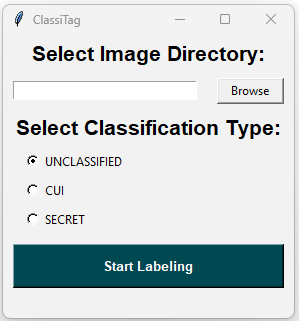

# ClassiTag - Image Classification Labeling

## Overview

This project provides a tool for adding classification labels to a large amount of images within a specified directory on Windows, Linux, or Mac systems. See example images below.

## Prerequisites

Make sure you have the following prerequisites installed on your system:

- Python 3.11 or higher
- Dependencies (see below)

## Usage  
The tool offers both an easy-to-use graphical user interface (GUI) or a classic command-line experience.  
### GUI
- Windows Executable: Download the latest release and run it to launch the GUI.
- Repository: If you run `classitag.py` without any CLI arguments it will also open the GUI.



### CLI
`classittag.py` takes two arguments.   
1. `directory_path`: The path to the directory containing the images.
2. `classification`: The classification type to be applied as an overlay (`UNCLASSIFIED`, `CUI`, or `SECRET`).

Example:  
```
python classtag/classitag.py /path/to/directory/ cui
```

The labeled images will be saved within the same directory, and the original will be saved in a newly created folder called `original_images`.  


## Sample output:

  

## Installation

### Manual setup

1. Clone the repository:

   ```bash
   git clone https://github.com/yourusername/ClassiTag.git
   cd ClassiTag
   ```

2. Install dependencies:

   ```bash
   pip install pillow
   pip install types-pillow
   pip install click
   pip install tk
   ```

### Bootstrap setup on Linux or MacOS

1. Clone the repository:

   ```bash
   git clone https://github.com/yourusername/ClassiTag.git
   cd classitag
   ```

2. Create a virtual environment (Make sure that you set the local version of pyenv to Python 3.11 or higher.):

   ```bash
   python -m venv .venv
   source .venv/bin/activate
   ```

3. Run the bootstrap script to set up dependencies:
    ```bash
    script/bootstrap
    ```
   This script installs system-level dependencies based on your operating system.

4. Install additional project dependencies:

   ```bash
   poetry install
   ```

# Development

## Running Tests (Coming Soon)

To run tests, use the following command:

```bash
poetry run pytest
```
## Dependencies

The project relies on the following Python libraries:

- `logging`: Standard library for logging messages.
- `click`: A command-line interface creation kit.
- `Pillow`: Python Imaging Library (PIL) for image processing.
- `tkinter`: Library for creating the GUI.
- `pyinstaller`: For executable creation if use requires an environment where python or dependency installation is unavailable.

## Notes

- The Python version utilized is 3.11.6.
- The classification arguments are not case-sensitive.
- Supported image formats: PNG, JPG, JPEG, BMP.
- If using pyinstaller to make an executable, you will have to replace the following line:
```bash
FONT = pathlib.Path(__file__).parent / ".." / "font" / "ARIALBD.TTF"
 ```
With:
```bash
FONT = pathlib.Path(sys._MEIPASS) / "font" / "ARIALBD.TTF"
```

## Contributing

Contributions are welcome! If you encounter issues or have suggestions, please open an issue or create a pull request.
